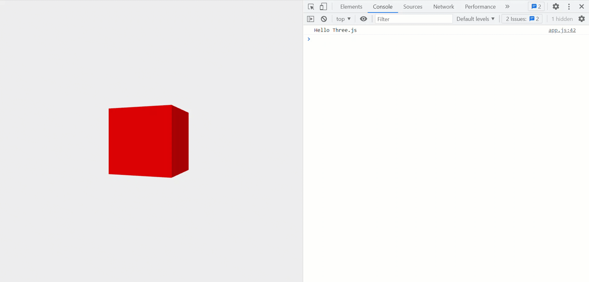

# Threejs-handsOn
Beginner exercises on three.js

Thanks to [Nik Lever](https://github.com/niklever) for creating a guided course on Three.js.

## Sample Preview

1. Hello Three.js with `Camera`, `Scene` and `WebGLRenderer`.

